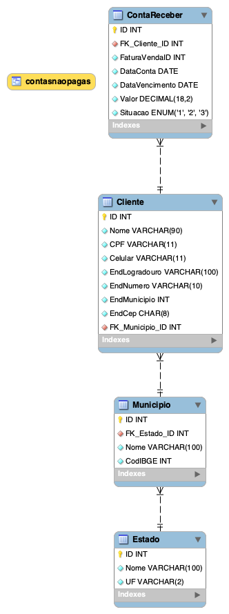

# 📦 Projeto Loja – Banco de Dados Relacional

Este projeto consiste na modelagem e implementação de um **banco de dados relacional** para controle de **clientes, localização (estado e município) e contas a receber**, utilizando **MySQL**.

O objetivo é demonstrar boas práticas de **modelagem de dados**, **relacionamentos**, **integridade referencial** e **consultas SQL**, incluindo a criação de uma *VIEW* para listar contas não pagas.

## 🗂️ Diagrama Entidade-Relacionamento (EER)

O diagrama abaixo representa a estrutura do banco de dados e os relacionamentos entre as tabelas:

## Tecnologias Utilizadas

* **MySQL**
* **SQL (DDL e DML)**
* MySQL Workbench (para modelagem do diagrama)

##  Estrutura do Banco de Dados

O banco de dados `loja` é composto pelas seguintes tabelas:

### 🔹 Estado

* Armazena os estados brasileiros.

### 🔹 Município

* Relacionado a um estado
* Contém código IBGE

### 🔹 Cliente

* Armazena dados cadastrais e endereço do cliente
* Relacionado a um município

### 🔹 ContaReceber

* Controla contas a receber dos clientes
* Contém datas, valor e situação da conta

##  Relacionamentos

* **Estado 1:N Município**
* **Município 1:N Cliente**
* **Cliente 1:N ContaReceber**

Todos os relacionamentos utilizam **chaves estrangeiras**, garantindo a integridade dos dados.

## View – Contas Não Pagas

Foi criada uma *VIEW* chamada `ContasNaoPagas`, que retorna apenas as contas em aberto, exibindo:

* ID da conta a receber
* Nome do cliente
* CPF
* Data de vencimento
* Valor da conta

Essa view facilita consultas e relatórios de cobrança.

---

##  Como Executar o Projeto

1. Crie o banco de dados no MySQL
2. Execute o script SQL para:

   * Criar as tabelas
   * Inserir dados de exemplo
   * Criar a view
3. Consulte a view `ContasNaoPagas` para visualizar as contas em aberto

---

##  Finalidade do Projeto

Este projeto é indicado para:

* Estudos de **modelagem de banco de dados**
* Prática de **SQL relacional**
* Trabalhos acadêmicos
* Portfólio no GitHub

---

## 👨‍💻 Autor

Desenvolvido por **[Raphaely Magalhaes]**

---

⭐ Se este projeto te ajudou, não esqueça de deixar uma estrela no repositó ❤️
